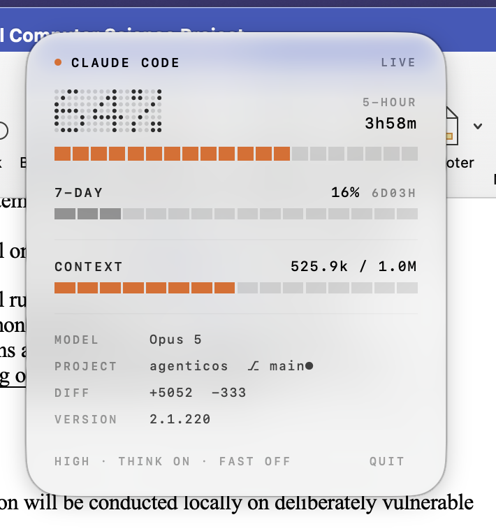

# ClaudeBar

Claude Code usage and limits in the macOS menu bar, in [GlassKit](../GlassKit)'s visual
language.



The menu bar shows your 5-hour usage as dot-matrix numerals with a progress hairline. Click
it for the full readout: both rate-limit windows with reset countdowns, context window usage,
and the current session's model, project, branch, diff and flags.

## Install

Requires macOS 26+ and the `claude-statusbar` status line (see *Where the data comes from*).

```bash
./build.sh release
open build/ClaudeBar.app
```

## Where the data comes from

Claude Code passes its status line a JSON payload on stdin every tick, containing rate
limits, context usage, model, version and session state. `claude-statusbar` caches that
payload verbatim to `~/.cache/claude-statusbar/last_stdin.json` and rewrites it roughly once
a second while any Claude Code window is open.

So the numbers are already on disk: first-party, structured, and fresh. ClaudeBar reads that
file. It does **not** reimplement usage tracking, scrape transcripts, or call an API —
inventing a second source of truth could only ever be less correct than Claude Code's own.

```
rate_limits.five_hour.used_percentage   →  the headline number
rate_limits.five_hour.resets_at         →  the countdown (epoch, so it survives sleep)
context_window.total_input_tokens       →  517.9k
context_window.context_window_size      →  / 1.0M
model.display_name                      →  Opus 5
workspace.repo.name + git               →  agenticos ⎇ main●
cost.total_lines_added / _removed       →  +5052 −333
effort.level, thinking, fast_mode       →  HIGH · THINK ON · FAST OFF
```

Set `CLAUDEBAR_PAYLOAD` to point at a different file.

## Design notes

**It never presents a stale reading as live.** The payload refreshes about once a second
while Claude Code is open; freshness is judged from the file's modification time, not from
when we happened to read it. Over ten seconds old and the header switches from `LIVE` to
`45S AGO` / `IDLE`, and the menu bar item dims. Showing a leftover number as current is the
one lie this app must not tell — and quietly reporting `0%` on a malformed payload would be
worse, so parsing throws rather than defaulting.

**The headline is always the 5-hour window**, never the larger of the two. The 5-hour limit
is the one that actually stops you mid-session, and a glance value that silently switched
which window it meant would be worse than useless. The 7-day figure is in the panel, labelled.

**With several Claude Code windows open, the payload is whichever ticked most recently.**
Rate limits are account-wide so they're always correct; the session rows show whichever
window last reported, labelled with its project so it's never ambiguous. This matches how the
status line itself behaves.

**Missing fields degrade, malformed payloads don't.** Claude Code's schema has grown over
time and an older build won't send some keys, so each field falls back to a placeholder
independently. A payload that isn't valid JSON at all is a different matter and throws.

**Git is cached for 15 seconds.** Two subprocesses per tick to learn something that changes a
few times a day would be silly.

## Layout

```
Sources/ClaudeBarKit/
  UsageSnapshot.swift   the model, formatting, and freshness rules
  UsageReader.swift     reads and parses the payload; caches git lookups
  ClaudeBarPanel.swift  the panel — composition only, no design code
Sources/ClaudeBar/
  ClaudeBarApp.swift    ~50 lines; everything else comes from GlassKit
Tests/                  14 tests, anchored to a real captured payload
```

## Tests

```bash
swift test
```

The test fixture is a real payload captured from a live session rather than a hand-invented
shape, so a field rename upstream fails the suite instead of silently zeroing the display.

## Known limits and next steps

**The data source is a third-party implementation detail.** `last_stdin.json` is, by its
name, a cache — `claude-statusbar` could rename it, wrap it, or write only on change and
break this app without ever knowing it exists. It also means ClaudeBar only works for people
running that particular status line.

Verified today: it writes *unconditionally* every tick (mtime advances even when the payload
is byte-identical), so judging freshness from mtime is sound. If that ever changes to
write-on-change, mtime would stall while the data was still valid and a live reading would be
dimmed — worth re-checking if the staleness indicator starts misbehaving.

**The hedge, not yet built:** Claude Code hands its payload to *whatever* status line command
is configured. The robust move is to be that command — a small shim that writes the payload
into ClaudeBar's own Application Support directory and then forwards stdin verbatim to the
user's previous status line, passing its stdout and exit code through unchanged. That
composes instead of displacing, so adopting ClaudeBar wouldn't cost anyone their existing
status line. It collapses three dependencies into one on Claude Code's documented integration
point. Not done here because it edits `~/.claude/settings.json`, which isn't something to do
unasked.

**Also worth doing first:** put a `UsageSnapshotSource` protocol at the boundary with today's
file reader as one implementation, so swapping transport is a one-liner. The parsing is
already isolated from the views — every field degrades independently and only a payload that
isn't JSON at all throws.

**What the tests can't see.** The 14 tests exercise parsing against a captured fixture. They
are structurally incapable of noticing the file moving, the upstream format changing, or the
tool not being installed — which is the actual risk. Green here is not evidence about the
integration, only about the parser.
